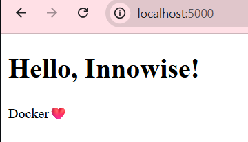

# Цель модуля: Перестать писать длинные docker run ... команды. Освоить docker-compose.yml для управления многоконтейнерными приложениями.

## 1. Задача (Теория): Что такое docker-compose.yml?

Контекст: Это YAML-файл, который декларативно (описательно) говорит Docker, что мы хотим запустить (сервисы, сети, вольюмы).
```
docker-compose.yml - файл, который показывает, какие контенеры должны быть созданы, на основе каких образов, в какой последовательности. Создает сеть, в котором контенеры могут видеть друг друга. 
```

Критерии: Вы понимаете, что Compose — это "рецепт" для запуска стека.

## 2. Задача (Установка): Убедиться, что docker compose (v2, плагин) или docker-compose (v1) установлен. (В Docker Desktop он встроен).
``` bash

PS C:\Users\katar\Desktop\СТАЖИРОВКА\devops_tr\module-04> docker compose version
Docker Compose version v5.1.4

```

## 3. Задача (Создание docker-compose.yml): Создать docker-compose.yml (версии 3.8 или 3.9).
``` bash

PS C:\Users\katar\Desktop\СТАЖИРОВКА\devops_tr\module-05> ls


    Каталог: C:\Users\katar\Desktop\СТАЖИРОВКА\devops_tr\module-05


Mode                 LastWriteTime         Length Name                                                                            
----                 -------------         ------ ----                                                                            
-a----        26.06.2026     11:42              0 docker-compose.yml                                                              
-a----        26.06.2026     11:31              0 README.md                                                                       

```

## 4. Задача (Сервис 1: App): Описать наш my-app (из М2) как сервис.

services:

app:

build: . (указывает на Dockerfile)

ports:

- "5000:5000"
``` yaml

version: '3.8'
services:
  app:
    build: .
    ports:
      - "5000:5000"

```


## 5. Задача (Сервис 2: DB): Описать PostgreSQL (из М4) как сервис.

db:

image: postgres:14-alpine

ports:

- "5432:5432"
``` yaml

version: '3.8'

services:
  app:
    build: .
    container_name: app
    ports:
      - "5000:5000"

  db:
    image: postgres:14-alpine
    container_name: bd
    ports:
      - "5432:5432"
    environment:
    - POSTGRES_PASSWORD=secret

```
``` bash

katar@Tecno MINGW64 ~/Desktop/СТАЖИРОВКА/devops_tr/module-05 (feature/module-04-docker-compose)
$ docker ps -a
CONTAINER ID   IMAGE                COMMAND                  CREATED              STATUS         PORTS                                         NAMES
9bd283a1fc53   postgres:14-alpine   "docker-entrypoint.s…"   8 seconds ago        Up 7 seconds   0.0.0.0:5432->5432/tcp, [::]:5432->5432/tcp   bd
61f081453dc3   module-05-app        "./myapp"                About a minute ago   Up 7 seconds   0.0.0.0:5000->5000/tcp, [::]:5000->5000/tcp   app

```


## 6. Задача (Запуск): Запустить все: docker-compose up.
```bash 

docker compose up     
time="2026-06-26T12:15:15+03:00" level=warning msg="C:\\Users\\katar\\Desktop\\СТАЖИРОВКА\\devops_tr\\module-05\\docker-compose.yml: the attribute `version` is obsolete, it will be ignored, please remove it to avoid potential confusion"
[+] up 2/2
 ✔ Container bd  Created                                                                                                0.2s
 ✔ Container app Created                                                                                                0.1s
Attaching to app, bd
bd  | The files belonging to this database system will be owned by user "postgres".
bd  | This user must also own the server process.
bd  | 
bd  | The database cluster will be initialized with locale "en_US.utf8".
bd  | The default database encoding has accordingly been set to "UTF8".
bd  | The default text search configuration will be set to "english".
bd  | 
bd  | Data page checksums are disabled.
bd  | 
bd  | fixing permissions on existing directory /var/lib/postgresql/data ... ok
bd  | creating subdirectories ... ok
bd  | selecting dynamic shared memory implementation ... posix
bd  | selecting default max_connections ... 100
bd  | selecting default shared_buffers ... 128MB
bd  | selecting default time zone ... UTC
bd  | creating configuration files ... ok
bd  | running bootstrap script ... ok
bd  | sh: locale: not found
bd  | 2026-06-26 09:15:18.244 UTC [34] WARNING:  no usable system locales were found
bd  | performing post-bootstrap initialization ... ok
bd  | initdb: warning: enabling "trust" authentication for local connections
bd  | You can change this by editing pg_hba.conf or using the option -A, or
bd  | --auth-local and --auth-host, the next time you run initdb.
bd  | syncing data to disk ... ok
bd  | 
bd  | 
bd  | Success. You can now start the database server using:
bd  | 
bd  |     pg_ctl -D /var/lib/postgresql/data -l logfile start
bd  | 
bd  | waiting for server to start....2026-06-26 09:15:20.267 UTC [40] LOG:  starting PostgreSQL 14.23 on x86_64-pc-linux-musl, compiled by gcc (Alpine 15.2.0) 15.2.0, 64-bit
bd  | 2026-06-26 09:15:20.276 UTC [40] LOG:  listening on Unix socket "/var/run/postgresql/.s.PGSQL.5432"
bd  | 2026-06-26 09:15:20.286 UTC [41] LOG:  database system was shut down at 2026-06-26 09:15:19 UTC
bd  | 2026-06-26 09:15:20.301 UTC [40] LOG:  database system is ready to accept connections
bd  |  done
bd  | server started
bd  | 
bd  | /usr/local/bin/docker-entrypoint.sh: ignoring /docker-entrypoint-initdb.d/*
bd  | 
bd  | waiting for server to shut down...2026-06-26 09:15:20.395 UTC [40] LOG:  received fast shutdown request
bd  | .2026-06-26 09:15:20.399 UTC [40] LOG:  aborting any active transactions
bd  | 2026-06-26 09:15:20.408 UTC [40] LOG:  background worker "logical replication launcher" (PID 47) exited with exit code 1
bd  | 2026-06-26 09:15:20.414 UTC [42] LOG:  shutting down
bd  | 2026-06-26 09:15:20.452 UTC [40] LOG:  database system is shut down
bd  |  done
bd  | server stopped
bd  | 
bd  | PostgreSQL init process complete; ready for start up.
bd  | 
bd  | 2026-06-26 09:15:20.549 UTC [1] LOG:  starting PostgreSQL 14.23 on x86_64-pc-linux-musl, compiled by gcc (Alpine 15.2.0) 15.2.0, 64-bit
bd  | 2026-06-26 09:15:20.550 UTC [1] LOG:  listening on IPv4 address "0.0.0.0", port 5432
bd  | 2026-06-26 09:15:20.552 UTC [1] LOG:  listening on IPv6 address "::", port 5432
bd  | 2026-06-26 09:15:20.561 UTC [1] LOG:  listening on Unix socket "/var/run/postgresql/.s.PGSQL.5432"
bd  | 2026-06-26 09:15:20.571 UTC [53] LOG:  database system was shut down at 2026-06-26 09:15:20 UTC
bd  | 2026-06-26 09:15:20.585 UTC [1] LOG:  database system is ready to accept connections

```
Критерии: В одном терминале вы видите логи обоих сервисов (чередующиеся).

## 7. Задача (Фоновый режим): Остановить (Ctrl+C). Запустить в фоне: docker-compose up -d.
```bash

PS C:\Users\katar\Desktop\СТАЖИРОВКА\devops_tr\module-05> docker-compose up -d
time="2026-06-26T12:16:48+03:00" level=warning msg="C:\\Users\\katar\\Desktop\\СТАЖИРОВКА\\devops_tr\\module-05\\docker-compose.yml: the attribute `version` is obsolete, it will be ignored, please remove it to avoid potential confusion"
[+] up 2/2
 ✔ Container bd  Running                                                                                                0.0s
 ✔ Container app Running                                                                                                0.0s
PS C:\Users\katar\Desktop\СТАЖИРОВКА\devops_tr\module-05> 

```
## 8. Задача (Управление): Посмотреть статус: docker-compose ps. Посмотреть логи: docker-compose logs app, docker-compose logs -f.

``` bash

PS C:\Users\katar\Desktop\СТАЖИРОВКА\devops_tr\module-05> docker compose ps
time="2026-06-26T12:17:31+03:00" level=warning msg="C:\\Users\\katar\\Desktop\\СТАЖИРОВКА\\devops_tr\\module-05\\docker-compose.yml: the attribute `version` is obsolete, it will be ignored, please remove it to avoid potential confusion"
NAME      IMAGE                COMMAND                  SERVICE   CREATED         STATUS         PORTS
app       module-05-app        "./myapp"                app       2 minutes ago   Up 2 minutes   0.0.0.0:5000->5000/tcp, [::]:5000->5000/tcp
bd        postgres:14-alpine   "docker-entrypoint.s…"   db        2 minutes ago   Up 2 minutes   0.0.0.0:5432->5432/tcp, [::]:5432->5432/tcp
PS C:\Users\katar\Desktop\СТАЖИРОВКА\devops_tr\module-05>

```

``` bash

PS C:\Users\katar\Desktop\СТАЖИРОВКА\devops_tr\module-05> docker compose logs
time="2026-06-26T12:18:07+03:00" level=warning msg="C:\\Users\\katar\\Desktop\\СТАЖИРОВКА\\devops_tr\\module-05\\docker-compose.yml: the attribute `version` is obsolete, it will be ignored, please remove it to avoid potential confusion"
bd  | The files belonging to this database system will be owned by user "postgres".
bd  | This user must also own the server process.
bd  | 
bd  | The database cluster will be initialized with locale "en_US.utf8".
bd  | The default database encoding has accordingly been set to "UTF8".
bd  | The default text search configuration will be set to "english".
bd  |

```

## 9. Задача (Остановка): Остановить и удалить все: docker-compose down.
```docker

PS C:\Users\katar\Desktop\СТАЖИРОВКА\devops_tr\module-05> docker compose down
time="2026-06-26T12:20:23+03:00" level=warning msg="C:\\Users\\katar\\Desktop\\СТАЖИРОВКА\\devops_tr\\module-05\\docker-compose.yml: the attribute `version` is obsolete, it will be ignored, please remove it to avoid potential confusion"
[+] down 3/3
 ✔ Container app             Removed                                                                                    0.5s
 ✔ Container bd              Removed                                                                                    0.6s
 ✔ Network module-05_default Removed                                                                                    0.3s
PS C:\Users\katar\Desktop\СТАЖИРОВКА\devops_tr\module-05> docker ps
CONTAINER ID   IMAGE     COMMAND   CREATED   STATUS    PORTS     NAMES
PS C:\Users\katar\Desktop\СТАЖИРОВКА\devops_tr\module-05> 

```

Контекст: down удаляет контейнеры и (по умолчанию) сеть.

## 10. Задача (Сборка): Явно пересобрать образ: docker-compose build. (Или docker-compose up --build).