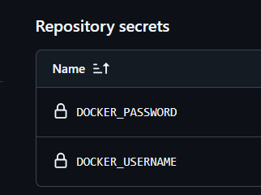

# Цель модуля: "Докрутить" CI-пайплайн: научить GitHub Actions собирать Dockerfile и "пушить" (push) готовый образ в Registry (e.g., Docker Hub, GHCR).

## 1. Задача (Теория): Что такое Docker Registry?

Контекст: Это "GitHub для Docker-образов". (Docker Hub, GitHub Container Registry (GHCR), GitLab Registry).

    Registry - специальные хранилище, из которых можно будет опубликовать и скачать готовые образы. 

Критерии: Вы понимаете, что Registry — это хранилище образов.

## 2. Задача (Настройка): Создать аккаунт на hub.docker.com (или использовать GHCR/GitLab Registry).

    https://hub.docker.com/u/kiwwa

## 3. Задача (Secrets): Создать Access Token. Добавить его в GitHub Secrets (в настройках репозитория): DOCKER_USERNAME и DOCKER_PASSWORD.



    Секреты используются в workflow через `${{ secrets.DOCKER_USERNAME }}`

## 4. Задача (CI-шаг: Login): Добавить в ci.yml шаг "Login to Docker Hub".
### ci.yml
```yaml
name: CI 

on:
  pull_request:
    branches: [main]

jobs:
  test:
    runs-on: ubuntu-latest

    defaults:
      run:
        working-directory: module-07

    steps:
      - name: checkout
        uses: actions/checkout@v4

      - name: setup python
        uses: actions/setup-python@v5
        with:
          python-version: '3.11'

      - name: install dependencies
        run: pip install -r requirements.txt

      - name: run tests
        run: pytest tests/ -v  

      - name: Login to Docker Hub
        uses: docker/login-action@v3
        with: 
          username: ${{ secrets.DOCKER_USERNAME }}
          password: ${{ secrets.DOCKER_PASSWORD }} 
```


- name: Login to Docker Hub

uses: docker/login-action@v3

with: { username: ${{ secrets.DOCKER_USERNAME }}, password: ${{ secrets.DOCKER_PASSWORD }} }

## 5. Задача (CI-шаг: Build & Push): Добавить шаг "Сборка и Публикация".

- name: Build and push

uses: docker/build-push-action@v5

with: { push: true, tags: your-username/my-app:latest }
```yaml
name: CI 

on:
  pull_request:
    branches: [main]

jobs:
  test:
    runs-on: ubuntu-latest

    defaults:
      run:
        working-directory: module-07

    steps:
      - name: checkout
        uses: actions/checkout@v4

      - name: setup python
        uses: actions/setup-python@v5
        with:
          python-version: '3.11'

      - name: install dependencies
        run: pip install -r requirements.txt

      - name: run tests
        run: pytest tests/ -v  

      - name: Login to Docker Hub
        uses: docker/login-action@v3
        with: 
          username: ${{ secrets.DOCKER_USERNAME }}
          password: ${{ secrets.DOCKER_PASSWORD }}

      - name: Build and push
        uses: docker/build-push-action@v5
        with:
          push: true
          tag:  kiwwa/my-app:latest
```

## 6. Задача (Тегирование): Улучшить тег. Использовать github.sha (хеш коммита).

tags: your-username/my-app:${{ github.sha }}
```yaml
tag:  kiwwa/my-app:${{ github.sha }}
```

Критерии: Каждый коммит создает уникальный образ.

## 7. Задача (Разделение Jobs): Разделить test и build-push. build-push должен зависеть от test (needs: test).
```yaml
name: CI 

on:
  pull_request:
    branches: [main]

jobs:
  test:
    runs-on: ubuntu-latest

    defaults:
      run:
        working-directory: module-07

    steps:
      - name: checkout
        uses: actions/checkout@v4

      - name: setup python
        uses: actions/setup-python@v5
        with:
          python-version: '3.11'

      - name: install dependencies
        run: pip install -r requirements.txt

      - name: run tests
        run: pytest tests/ -v  

  build-push:
    runs-on: ubuntu-latest
    needs: test
    steps:
      - name: Login to Docker Hub
        uses: docker/login-action@v3
        with: 
          username: ${{ secrets.DOCKER_USERNAME }}
          password: ${{ secrets.DOCKER_PASSWORD }}

      - name: Build and push
        uses: docker/build-push-action@v5
        with:
          context: ./module-07
          push: true
          tag: kiwwa/my-app:${{ github.sha }}
```

Критерии: Сборка образа не начнется, если тесты упали.

## 8. Задача (Разделение Workflows): Сделать 2 workflow: 1) ci.yml (на pull_request, только тесты). 2) cd.yml (на push в main, только build-push).
### ci.yml
```yaml
name: CI 

on:
  pull_request:
    branches: [main]

jobs:
  test:
    runs-on: ubuntu-latest

    defaults:
      run:
        working-directory: module-07

    steps:
      - name: checkout
        uses: actions/checkout@v4

      - name: setup python
        uses: actions/setup-python@v5
        with:
          python-version: '3.11'

      - name: install dependencies
        run: pip install -r requirements.txt

      - name: run tests
        run: pytest tests/ -v  
```
### cd.yml
```yaml
name: CD

on:
  push:
    branches: [main]

jobs:
  build-push:
    runs-on: ubuntu-latest

    steps:
      - name: checkout
        uses: actions/checkout@v4

      - name: Login to Docker Hub
        uses: docker/login-action@v3
        with: 
          username: ${{ secrets.DOCKER_USERNAME }}
          password: ${{ secrets.DOCKER_PASSWORD }}

      - name: Build and push
        uses: docker/build-push-action@v5
        with:
          context: ./module-07
          push: true
          tags: kiwwa/my-app:${{ github.sha }}
```

Критерии: Логика CI/CD разделена. main всегда содержит "готовый к деплою" образ.

## 9. Задача (Multi-arch build): Изучить docker/setup-qemu-action и docker/setup-buildx-action.

Контекст: Для сборки образов, которые работают и на M1/M2/M3 (ARM) и на Intel (AMD64).
### Multi-arch build 
    Buildx (сборщик) и qemu (переводчик) позволяют сохдавать образы для различных архитектур:
    * linux/amd64 - Intel/AMD процнссоры
    * linux/arm64 - Apple М1/М2/М3
Задание: Добавить buildx и qemu и в build-push-action указать platforms: linux/amd64,linux/arm64.
```yaml
name: CD

on:
  push:
    branches: [main]

jobs:
  build-push:
    runs-on: ubuntu-latest

    steps:
      - name: checkout
        uses: actions/checkout@v4

      - name: Login to Docker Hub
        uses: docker/login-action@v3

      - name: Use qemu
        uses: docker/setup-qemu-action@v3

      - name: Use buildx
        uses: docker/setup-buildx-action@v3
        
      - uses: docker/login-action@v3
        with: 
          username: ${{ secrets.DOCKER_USERNAME }}
          password: ${{ secrets.DOCKER_PASSWORD }}

      - name: Build and push
        uses: docker/build-push-action@v5
        with:
          context: ./module-07
          push: true
          tags: kiwwa/my-app:${{ github.sha }}
```
Критерии: CI/CD собирает multi-arch образ.

## 10. Задача (Docker Hub): Зайти в свой Docker Hub и увидеть список всех образов, собранных CI/CD.

Критерии: Вы видите my-app:latest и my-app:[hash].