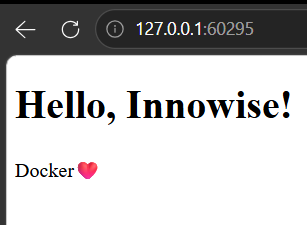

# Цель модуля: Научиться декларативно (через YAML) развертывать stateless-приложения (e.g., наш my-app из М8).

## 1. Задача (Теория): Декларативность. "Я хочу 3 реплики" (а не "запусти, потом запусти, потом запусти").

    Декларативность: с k8s можно работь с деларативным подходом (файл yml описывает желаемое состояние) и императивным (в терминале пропись действий) 

## 2. Задача (Сборка): Собрать образ my-app (из М8) так, чтобы Minikube его "увидел": eval $(minikube docker-env) (на Mac/Linux) и docker build -t my-app:k8s .
```bash
IMAGE                                             ID             DISK USAGE   CONTENT SIZE   EXTRA
gcr.io/k8s-minikube/storage-provisioner:v5        6e38f40d628d       31.5MB             0B    U   
my-app:k8s                                        91fbe6818a80        141MB             0B    
```
Критерии: Образ собран во внутреннем Docker-демоне Minikube.

## 3. Задача (YAML - Deployment): Создать app-deployment.yml.

apiVersion: apps/v1

kind: Deployment

metadata: { name: my-app-deployment }
```yml
apiVersion: apps/v1
kind: Deployment
metadata: 
  name: my-app-deployment 
```
## 4. Задача (YAML - spec): Описать spec деплоймента:
spec: { replicas: 3 }
```yml
apiVersion: apps/v1
kind: Deployment
metadata:
  name: my-app-deployment
spec:
  replicas: 3
```
    spec - выводит спецификацию самого deployment
## 5. Задача (YAML - template): Описать template (Pod), который будет тиражироваться.

template: { metadata: { labels: { app: my-app } } }
```yml
apiVersion: apps/v1
kind: Deployment
metadata:
  name: my-app-deployment
spec:
  replicas: 3
  template:
    metadata: 
      labels:
        app: my-app
```
    template - строка, после которой описываются данные о поде
    labels - помечает поды, за которые будут отвечать другие модули

## 6. Задача (YAML - container): Описать spec контейнера (внутри template).

spec: { containers: [ { name: my-app, image: my-app:k8s, imagePullPolicy: IfNotPresent } ] }
```yml
apiVersion: apps/v1
kind: Deployment
metadata:
  name: my-app-deployment
spec:
  replicas: 3
  template:
    metadata:
      labels:
        app: my-app
    spec: # spec находится на уровне 
      containers:
        - name: my-app
          image: my-app:k8s
          imagePullPolicy: IfNotPresent
```
Контекст: IfNotPresent обязателен, чтобы K8s использовал локальный образ, а не искал его в Docker Hub.
## 7. Задача (Применение):
Критерии: kubectl get pods -l app=my-app показывает 3 запущенных Pod'а.

```bash
PS C:\Users\katar\Desktop\СТАЖИРОВКА\devops_tr\module-12> kubectl get pods                   
NAME                                 READY   STATUS    RESTARTS   AGE
my-app-deployment-64fb87fb94-ckfxs   1/1     Running   0          6s
my-app-deployment-64fb87fb94-qxmjj   1/1     Running   0          6s
my-app-deployment-64fb87fb94-vj95h   1/1     Running   0          6s
PS C:\Users\katar\Desktop\СТАЖИРОВКА\devops_tr\module-12>
```
## 8. Задача (Self-healing): "Убить" Pod: kubectl delete pod [pod-name].

Критерии: Deployment немедленно замечает пропажу и запускает новый Pod.
```bash
PS C:\Users\katar\Desktop\СТАЖИРОВКА\devops_tr\module-12> kubectl get pods
NAME                                 READY   STATUS    RESTARTS   AGE
my-app-deployment-64fb87fb94-ckfxs   1/1     Running   0          37s
my-app-deployment-64fb87fb94-qxmjj   1/1     Running   0          37s
my-app-deployment-64fb87fb94-vj95h   1/1     Running   0          37s
PS C:\Users\katar\Desktop\СТАЖИРОВКА\devops_tr\module-12> kubectl delete pods my-app-deployment-64fb87fb94-ckfxs
pod "my-app-deployment-64fb87fb94-ckfxs" deleted from default namespace
PS C:\Users\katar\Desktop\СТАЖИРОВКА\devops_tr\module-12> kubectl get pods                                      
NAME                                 READY   STATUS    RESTARTS   AGE
my-app-deployment-64fb87fb94-df4tj   1/1     Running   0          3s
my-app-deployment-64fb87fb94-qxmjj   1/1     Running   0          51s
my-app-deployment-64fb87fb94-vj95h   1/1     Running   0          51s
PS C:\Users\katar\Desktop\СТАЖИРОВКА\devops_tr\module-12> 
```
## 9. Задача (YAML - Service): Создать app-service.yml (kind: Service).

spec: { selector: { app: my-app }, ports: [ { port: 80, targetPort: 5000 } ], type: NodePort }
```yml
apiVersion: v1
kind: Service
metadata:
  name: my-app-service
spec:
  selector:
      app: my-app
  ports:
    - port: 80
      targetPort: 5000
type: NodePort
```
Контекст: selector находит Pod'ы. NodePort "выставляет" сервис наружу.
## 10. Задача (Тестирование): kubectl apply -f app-service.yml. Запустить: minikube service my-app-service.


Критерии: Приложение открывается в браузере.