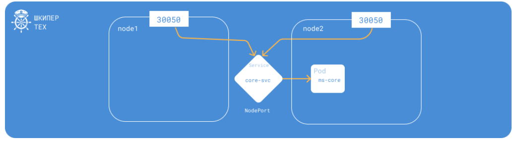
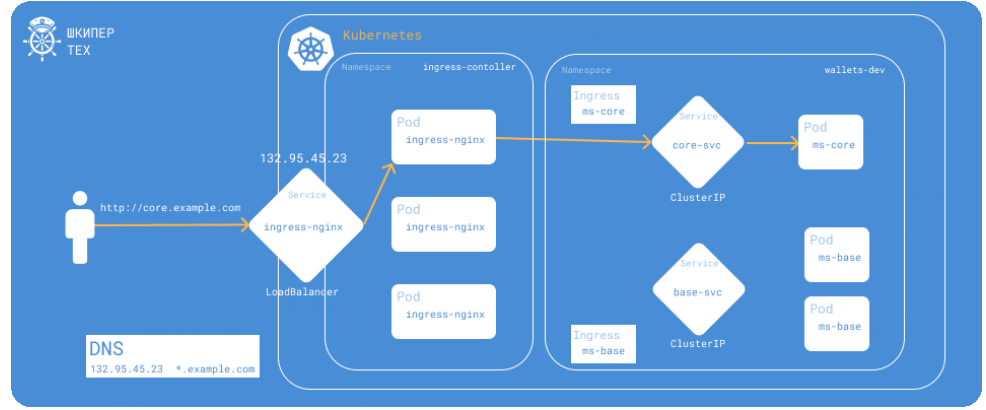

# Цель модуля: Перестать использовать NodePort (неудобно). Настроить Ingress (L7-балансировщик) для "красивых" URL. Освоить Helm (пакетный менеджер K8s).

## 1. Задача (Теория): NodePort vs LoadBalancer vs Ingress.

Контекст: NodePort (порт на каждой ноде, неудобно). LoadBalancer (дорого, просит IP у облака). Ingress (L7-маршрутизация, e.g., app.com/api -> app-service).

* ClusterIp - сервис по умолчанию, создается сеть внутри кластера и поды (сервисы) могут общаться друг с другом по именам (DNS записям). Нет доступа извне кластера;
* NodePort - сервис, с помощию которого можно обращаться к приложению по ip и порту, NodePort открывает доступ к приложению через конкретный порт на всех нодах кластера. Это значит, что любой запрос на этот порт на любой ноде будет перенаправлен к подам, которые обслуживаются сервисом. Этот тип сервиса открывает доступ к приложению извне, но через ограниченные порты (30000–32767).

* LoadBalancer - сервис, который надо подключать отдельным модулем (не доступен из коробки от кубера), Тип сервиса LoadBalancer создаётся для подключения из внешнего мира к вашему приложению. Это идеальный вариант, если вы хотите связать внешние запросы с вашим приложением через стабильный IP-адрес, требует поддержки со стороны облачного провайдера.

* Ingres - мощный инструмент, который позволяет организовать доступ к Вашим приложениям извне кластера через HTTP/HTTPS. С ClusterIp работаю на пару. Безопаснее LoadBalancer и NodePort.

```yml
apiVersion: networking.k8s.io/v1
kind: Ingress
metadata:
  name: my-app-ingress
  annotations:
    nginx.ingress.kubernetes.io/rewrite-target: /
spec:
  rules:
    - http:
        paths:
          - path: /app
            pathType: Prefix
            backend:
              service:
                name: my-app-service
                port:
                  number: 80
```
## 2. Задача (Включение Ingress): Включить Ingress Controller в Minikube: minikube addons enable ingress.

Критерии: Nginx Ingress Controller запущен.

## 3. Задача (YAML - Ingress): Создать app-ingress.yml (kind: Ingress, apiVersion: networking.k8s.io/v1).
```yml
apiVersion: networking.k8s.io/v1
kind: Ingress
```
## 4. Задача (Правила Ingress): Описать spec.rules:
```yml
apiVersion: networking.k8s.io/v1
kind: Ingress
metadata:
  name: my-app-ingress
spec:
  rules:
    - http:
        paths:
          - path: /app
            pathType: Prefix
            backend:
              service:
                name: my-app-service
                port:
                  number: 80
```
http: { paths: [ { path: /app, pathType: Prefix, backend: { service: { name: my-app-service, port: { number: 80 } } } } ] }
```yml
NAME             CLASS   HOSTS   ADDRESS   PORTS   AGE
my-app-ingress   nginx   *                 80      11s
```
Критерии: Правило создано.

## 5. Задача (Тест Ingress): kubectl apply -f app-ingress.yml. Узнать IP Minikube (minikube ip).
```bash
PS C:\Users\katar\Desktop\СТАЖИРОВКА\devops_tr\module-14> minikube ip
192.168.49.2
```
Критерии: curl $(minikube ip)/app возвращает ответ от my-app-service.

   Т к minilube работает на отдельной wsl, у которой своя изолированная сеть, то домашний хост не видит wsl, поэтому пришлось делать port-forward

```bash
  kubectl port-forward -n ingress-nginx service/ingress-nginx-controller 8080:80 --address=0.0.0.0
```
```bash
$ curl http://localhost:8080/app
<!DOCTYPE html>
<html>

<head>
    <title>Welcome</title>
</head>

<body>
    <h1>Hello, Innowise! </h1>
    <p>Docker❤️</p>
</body>

</html>
```
## 6. Задача (Ingress (Host-based)): Настроить DNS. Добавить $(minikube ip) my-app.local в /etc/hosts (или C:\...). Изменить Ingress.yml, добавив host: my-app.local.
```bash

$ curl http://my-app.local:8080/app
<!DOCTYPE html>
<html>

<head>
    <title>Welcome</title>
</head>

<body>
    <h1>Hello, Innowise! </h1>
    <p>Docker❤️</p>
</body>

</html>
```
Критерии: http://my-app.local/app работает.

## 7. Задача (Теория): Что такое Helm?
 Helm — это "менеджер пакетов", который решает проблему сложности управления множеством YAML-файлов в Kubernetes. Вместо того чтобы вручную создавать и применять десятки конфигураций, используются Helm-чарты (charts) — это упакованные, готовые к использованию шаблоны приложений.я
Контекст: Это "Apt" или "Pip" для Kubernetes. Позволяет установить Postgres (который состоит из 5-7 YAML-файлов) одной командой.

## 8. Задача (Установка Helm): Установить Helm.
```bash
version.BuildInfo{Version:"v4.2.2", GitCommit:"b05881cf967a5a09e19866799d0edfd40675803a", GitTreeState:"clean", GoVersion:"go1.26.4", KubeClientVersion:"v1.36"}
```
## 9. Задача (Helm Repo): Добавить репозиторий: helm repo add bitnami https://charts.bitnami.com/bitnami.
```bash
"bitnami" has been added to your repositories
```
```bash
katar@Tecno:/mnt/c/Users/katar/Desktop/СТАЖИРОВКА/devops_tr/module-14$ helm repo list
NAME    URL                               
bitnami https://charts.bitnami.com/bitnami
```
## 10. Задача (Helm Install): Удалить наш Postgres (из М13). Установить его через Helm: helm install my-pg bitnami/postgresql.
### Установка Postgres через Helm
```bash
helm install my-pg bitnami/postgresql
```
Критерии: helm list показывает my-pg. K8s запущен.
```bash
$ helm list
NAME    NAMESPACE       REVISION        UPDATED                                 STATUS          CHART                   APP VERSION
my-pg   default         1               2026-07-04 14:08:52.4074965 +0300 +03   deployed        postgresql-18.7.11      18.4.0
```
```bash
PS C:\Users\katar\Desktop\СТАЖИРОВКА\devops_tr> kubectl get pods
NAME                                 READY   STATUS    RESTARTS   AGE
my-app-deployment-78fd9bb8b8-4ldtz   1/1     Running   0          25h
my-app-deployment-78fd9bb8b8-7r4gl   1/1     Running   0          25h
my-app-deployment-78fd9bb8b8-lmzsj   1/1     Running   0          25h
my-pg-postgresql-0                   1/1     Running   0          59s
```
  Helm использовал StatefulSet вместо Deployment, потому что для баз данных нужны стабильные сетевые имена и привязка к хранилищу.
```bash
katar@Tecno MINGW64 ~/Desktop/СТАЖИРОВКА/devops_tr/module-14 (main)
$ kubectl get deployment
NAME                READY   UP-TO-DATE   AVAILABLE   AGE
my-app-deployment   3/3     3            3           25h

katar@Tecno MINGW64 ~/Desktop/СТАЖИРОВКА/devops_tr/module-14 (main)
$ kubectl get statefulset
NAME               READY   AGE
my-pg-postgresql   1/1     4m22s
```