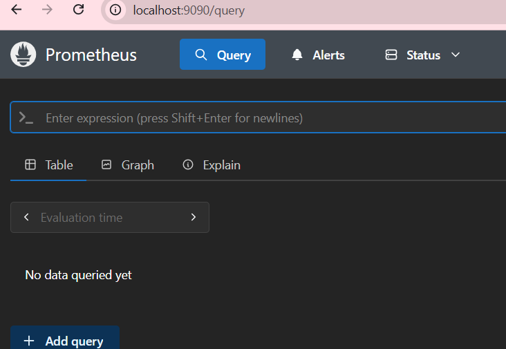
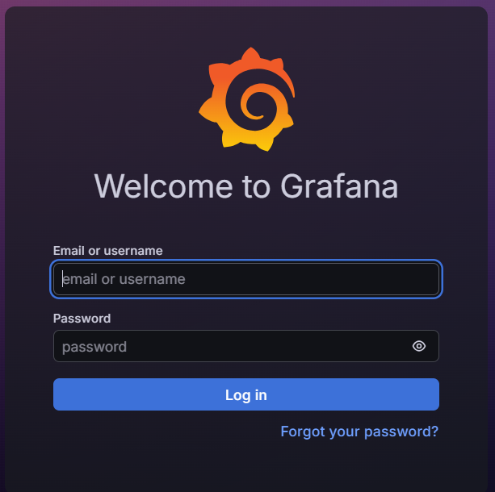
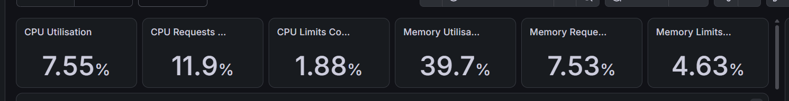
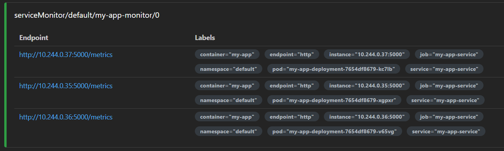

# Цель модуля: Научиться "видеть", что происходит внутри K8s-кластера. Настроить мониторинг (Metrics) и логирование.

## 1. Задача (Теория): Observability (3 столпа).
    Observability - способность понять, что происходит в системе, использует 3 столпа:
    * Metrics - способность понять, что с системой, с помощью системынх показателей, например: CPU - 80% (80% процессора загружено), память 3ГБ. По данным можно строить графики. Инструменты: Prometheus, Grafana;
    * Logs - записи о конкретных дествиях с временными/последовательнимы записями. Показывают, что произошло. Инструменты: Loki, ELK;
    * Traces - пусть запроса во всей системе микросервисов, показывает длительность ответа одного сервиса, позволяет найти проблеммные места. Инструменты: Zipkin.

Контекст: 1. Metrics (Цифры, e.g., CPU 80% - Prometheus). 2. Logs (События, e.g., "User login" - Loki/Elastic). 3. Traces (Путь запроса - Jaeger/Zipkin).

Критерии: Вы понимаете разницу.

## 2. Задача (Helm Install Prometheus): Установить Prometheus Stack.

helm repo add prometheus-community https://prometheus-community.github.io/helm-charts

helm install prometheus prometheus-community/kube-prometheus-stack -n monitoring --create-namespace
```bash
$ helm list -A
NAME            NAMESPACE       REVISION        UPDATED                                 STATUS          CHART
APP VERSION
my-pg           default         1               2026-07-04 14:08:52.4074965 +0300 +03   deployed        postgresql-18.7.11
18.4.0
prometheus      monitoring      1               2026-07-04 14:41:07.2546393 +0300 +03   deployed        kube-prometheus-stack-87.6.0v0.92.1
```
Критерии: Prometheus и Grafana развернуты.

## 3. Задача (Доступ к Prometheus): kubectl port-forward -n monitoring svc/prometheus-k8s 9090.
```bash
$ kubectl port-forward -n monitoring svc/prometheus-kube-prometheus-prometheus 9090:9090
Forwarding from 127.0.0.1:9090 -> 9090
Forwarding from [::1]:9090 -> 9090
Handling connection for 9090
Handling connection for 9090
```
Критерии: http://localhost:9090 (UI Prometheus) открывается.

## 4. Задача (Доступ к Grafana): kubectl port-forward -n monitoring svc/prometheus-grafana 3000.

Критерии: http://localhost:3000 (UI Grafana) открывается. (Пароль: kubectl get secret ...).
```bash
PS C:\Users\katar\Desktop\СТАЖИРОВКА\devops_tr> kubectl port-forward -n monitoring svc/prometheus-grafana 3000:80
Forwarding from 127.0.0.1:3000 -> 3000
Forwarding from [::1]:3000 -> 3000
```

## 5. Задача (Изучение Grafana): Зайти в Grafana. Открыть Dashboards. Найти дашборды, которые kube-prometheus-stack установил автоматически (e.g., "K8s / Compute Resources / Cluster").
```bash 
[System.Text.Encoding]::UTF8.GetString([System.Convert]::FromBase64String((kubectl --namespace monitoring get secrets prometheus-grafana -o jsonpath="{.data.admin-password}")))
OggBI0vi4QKn9bmTAQObcQKjUVNyDQZZTGSHVE0M 
```
Критерии: Вы видите графики CPU/Memory вашего Minikube-кластера.
    kube-prometheus-stack автоматически установил десятки дашбордов. Дашборд Kubernetes / Compute Resources / Cluster показывает реальные метрики кластера:

## 6. Задача (Теория): Как Prometheus "находит" сервисы? (ServiceMonitor).
    Prometheus в K8s не требует ручного прописывания IP подов. Он автоматически ищет объекты kind: ServiceMonitor, которые описывают кого опрашивать (scrape) через label selector. Когда поды пересоздаются с новыми IP — Prometheus сам подхватывает новые.
Контекст: Prometheus (в K8s) автоматически ищет объекты kind: ServiceMonitor, которые описывают, кого опрашивать (scrape).

## 7. Задача (App-side): "Выставить" метрики из my-app.
    я работаю с языком GO, поэтому надо выполнить след команды, чтобы веб сайт на go мог отлеживаться: 
```baah
go get github.com/prometheus/client_golang/prometheus/promhttp
go mod tidy 
# потом создала новый образ
docker build -t my-app:v2 .
# забросила его в minikube
inikube image load my-app:v2
# пересоздала deployment
kubectl apply -f deployment-updated.yaml
# PS C:\Users\katar\Desktop\СТАЖИРОВКА\devops_tr\module-15> curl.exe http://localhost:5000/metrics  
# HELP go_gc_duration_seconds A summary of the wall-time pause (stop-the-world) duration in garbage collection cycles.
# TYPE go_gc_duration_seconds summary
go_gc_duration_seconds{quantile="0"} 0
go_gc_duration_seconds{quantile="0.25"} 0
go_gc_duration_seconds{quantile="0.5"} 0
```
Задание: Добавить в my-app библиотеку (e.g., prometheus-client для Python, micrometer-prometheus для Java/C#) и эндпоинт /metrics.
```go
package main

import (
	"html/template"
	"net/http"

	"github.com/prometheus/client_golang/prometheus/promhttp"
)

func main() {
	http.Handle("/metrics", promhttp.Handler())

	http.HandleFunc("/", homePage)

	http.ListenAndServe(":5000", nil)
}

func homePage(w http.ResponseWriter, r *http.Request) {
	tmpl, err := template.ParseFiles("home_page.html")
	if err != nil {
		http.Error(w, err.Error(), http.StatusInternalServerError)
		return
	}

	data := struct {
		Title   string
		Message string
	}{
		Title:   "Welcome",
		Message: "Hello, Innowise! ",
	}

	tmpl.Execute(w, data)
}
```
```bash
minikube image load my-app:latest
```
Критерии: Пересобрать и передеплоить my-app. kubectl port-forward pod/my-app... 5000 -> curl localhost:5000/metrics показывает метрики.
```bash
 echo $POD_NAME
my-app-deployment-64857bd99-cwmck
```
```bash
$ kubectl port-forward pod/$POD_NAME 5000:5000
Forwarding from 127.0.0.1:5000 -> 5000
Forwarding from [::1]:5000 -> 5000
```

## 8. Задача (YAML - ServiceMonitor): Создать app-monitor.yml (kind: ServiceMonitor).

Задание: Описать selector: { matchLabels: { app: my-app } } и endpoints: [ { port: "http" } ] (предполагая, что порт в Service назван "http").
```yml
apiVersion: v1
kind: ServiceMonitor
metadata:
  name: my-app-monitor
  namespace: default
spec:
  selector:
    matchLabels:
      app: my-app
  endpoints:
    - port: "http"
      path: /metrics
      interval: 15s
```
Критерии: kubectl apply ....
```bash
PS C:\Users\katar\Desktop\СТАЖИРОВКА\devops_tr\module-15> kubectl get servicemonitor          
NAME             AGE
my-app-monitor   32s
```
## 9. Задача (Проверка): Зайти в UI Prometheus -> Status -> Targets.

Критерии: Через 1-2 минуты Prometheus автоматически нашел Pod'ы my-app и начал собирать с них /metrics.


Чтобы prometeus видел поды нужно было чуть изменить servicemonitor, добавив туда labels
```yml
apiVersion: monitoring.coreos.com/v1
kind: ServiceMonitor
metadata:
  name: my-app-monitor
  namespace: default
  labels:
    release: prometheus
spec:
  selector:
    matchLabels:
      app: my-app
  endpoints:
    - port: "http"
      path: /metrics
      interval: 15s
```
чтобы запустить проброс портов: 
```bash
 kubectl port-forward -n monitoring svc/prometheus-kube-prometheus-prometheus 9090:9090
Forwarding from 127.0.0.1:9090 -> 9090
Forwarding from [::1]:9090 -> 9090
Handling connection for 9090
Handling connection for 9090
```
## 10. Задача (Логи): Основы логирования.

Задание: kubectl logs deployment/my-app-deployment. kubectl logs -f ... (streaming).
```bash
PS C:\Users\katar\Desktop\СТАЖИРОВКА\devops_tr\module-15> kubectl logs deployment/my-app-deployment
Found 3 pods, using pod/my-app-deployment-7654df8679-kc7lb
```
    Чтобы можно было просмотреть логи моего приложения на go, нужно в код отдельно прописать нужные команды
Критерии: Вы можете посмотреть логи любого Pod'а в кластере.