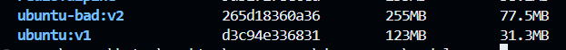
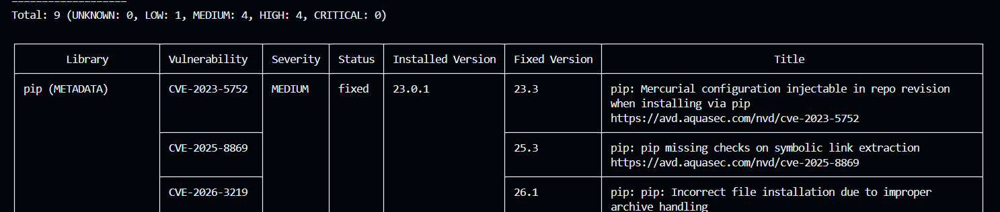
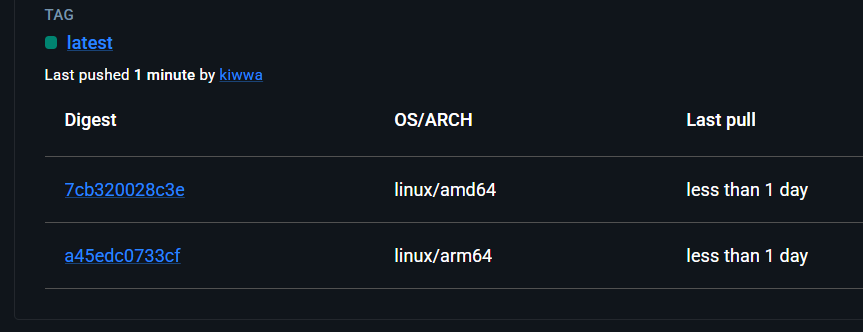

# Модуль 1: "Закалка" Docker (Security & Optimization)
Цель модуля: Перейти от "просто работает" Dockerfile к "безопасному и быстрому" Dockerfile.
## 1. Задача (Теория): Анализ Dockerfile (Linting).
Контекст: hadolint — это "linter" для Dockerfile.

    Hadolint - линтер для Dockerfile, который проверят на бест практис Dockerfile, укажет на ошибки, например: использование run apt update без очистики файла rm -rf /var/lib/apt/lists/*. (Команда apt get update обновляет каталог, в котором храняться все пути для скчаивания утилит и тд, используется, когда нужно конкретно далее установить нужную утилиту)

### установка Hadolint на винду
```bash
Set-ExecutionPolicy RemoteSigned -Scope CurrentUser                                   
irm get.scoop.sh | iex                                                                
scoop install hadolint

PS C:\Users\katar\Desktop\СТАЖИРОВКА\devops_pro> hadolint --version 
Haskell Dockerfile Linter 2.14.0
```
Задание: Установить hadolint. Написать "плохой" Dockerfile (e.g., RUN apt update и RUN apt install отдельно) и проанализировать его.
Критерии: hadolint показывает ошибки и рекомендации.
```dockerfile
#плохой dockerfile
FROM ubuntu:latest

RUN apt-get update
RUN apt-get -y install curl

CMD ["curl", "google.com"]
```
### Результат
```bash
PS C:\Users\katar\Desktop\СТАЖИРОВКА\devops_pro\module-01> hadolint Dockerfile
Dockerfile:1 DL3007 warning: Using latest is prone to errors if the image will ever update. Pin the version explicitly to a release tag
Dockerfile:3 DL3009 info: Delete the apt lists (/var/lib/apt/lists) after installing something
Dockerfile:3 DL3027 warning: Do not use apt as it is meant to be an end-user tool, use apt-get or apt-cache instead
Dockerfile:4 DL3059 info: Multiple consecutive `RUN` instructions. Consider consolidation.
Dockerfile:4 DL3027 warning: Do not use apt as it is meant to be an end-user tool, use apt-get or apt-cache instead
```
```dockerfile
# хороший dockerfile
FROM ubuntu:22.04

RUN apt-get update && \
    apt-get -y install --no-install-recommends curl=7.81.0-1ubuntu1.16 && \
    apt-get clean && \
    rm -rf /var/lib/apt/lists/*

CMD ["curl", "google.com"]
```
    При данном Dockerfile вывод в терминал после команды hadolint Dockerfile отсутвует

## 2. Задача (Оптимизация): Слияние RUN слоев.
Задание: Исправить Dockerfile из Задачи 1, объединив RUN через && для уменьшения количества слоев.
Критерии: hadolint больше не ругается; docker history показывает меньше слоев.



```bash
PS C:\Users\katar\Desktop\СТАЖИРОВКА\devops_pro\module-01> docker history ubuntu:v1
IMAGE          CREATED         CREATED BY                                      SIZE      COMMENT
d3c94e336831   3 minutes ago   CMD ["curl" "google.com"]                       0B        buildkit.dockerfile.v0
<missing>      3 minutes ago   RUN /bin/sh -c apt-get update &&     apt-get…   4.16MB    buildkit.dockerfile.v0
<missing>      7 days ago      /bin/sh -c #(nop)  CMD ["/bin/bash"]            0B        
<missing>      7 days ago      /bin/sh -c #(nop) ADD file:c5143b228eb55f19e…   87.7MB    
<missing>      7 days ago      /bin/sh -c #(nop)  LABEL org.opencontainers.…   0B        
<missing>      7 days ago      /bin/sh -c #(nop)  ARG LAUNCHPAD_BUILD_ARCH     0B        
<missing>      7 days ago      /bin/sh -c #(nop)  ARG RELEASE                  0B        
PS C:\Users\katar\Desktop\СТАЖИРОВКА\devops_pro\module-01> docker history ubuntu-bad:v2
IMAGE          CREATED              CREATED BY                                      SIZE      COMMENT
265d18360a36   About a minute ago   CMD ["curl" "google.com"]                       0B        buildkit.dockerfile.v0
<missing>      About a minute ago   RUN /bin/sh -c apt-get -y install curl # bui…   21.8MB    buildkit.dockerfile.v0
<missing>      About a minute ago   RUN /bin/sh -c apt-get update # buildkit        40.4MB    buildkit.dockerfile.v0
<missing>      3 weeks ago          umoci raw add-layer --image /home/buildd/roc…   12.3kB    Add rock control metadata
<missing>      3 weeks ago          umoci config --image /home/buildd/rockcraft-…   0B        Set annotations
<missing>      3 weeks ago          umoci config --image /home/buildd/rockcraft-…   0B        Set labels
<missing>      3 weeks ago          umoci config --image /home/buildd/rockcraft-…   0B        Set default PATH for bare-based rock
<missing>      3 weeks ago          umoci config --image /home/buildd/rockcraft-…   0B        Set default commands
<missing>      3 weeks ago          umoci config --image /home/buildd/rockcraft-…   0B        Set entrypoint
<missing>      3 weeks ago          umoci raw add-layer --image /home/buildd/roc…   115MB 
```
## 3. Задача (Безопасность): Сканирование уязвимостей (Vulnerability Scanning).
Задание: Установить Trivy (от Aqua Security). Собрать образ на старом python:3.8-slim-buster. Просканировать его: trivy image my-app:1.0.

    Trivy ищет уязвимости, ошибки конфигурации и секреты, проверяет образы, на основе которых собирается новый образ

Критерии: Trivy показывает список CVE (уязвимостей).



## 4. Задача (Исправление): Пересобрать образ на python:3.11-slim-bullseye (более новой).
Критерии: trivy image my-app:2.0 показывает 0 HIGH/CRITICAL уязвимостей.

    при python:3.11-slim-bullseye все равно показывает уязвимости

## 5. Задача (Теория): BuildKit.
Контекст: BuildKit — это новый, параллельный и более быстрый сборщик Docker.

    В моей версии Docker BuildKit уже встроен в демон по умолчанию. BuildKit позволяет выполнять действия параллельно, если это возможно, а не последовательно.

Задание: Включить BuildKit (DOCKER_BUILDKIT=1). Пересобрать образ.
Критерии: Вывод docker build изменился (стал "древовидным").
## 6. Задача (BuildKit Cache): Использование RUN --mount=type=cache.
Контекст: Как кешировать apt или pip между сборками?

    Допустим, у нас есть requirement.txt при котором есть 5 видов окружения для скачивания. При дальнейшем измении файла, ранее скаченные виды окружения не будут заново скачиваться, а будут браться из кеша. При добавлении строки --mount=type=cache даже при полной очистке кеша докера, кеш скаченного ранее октружения останется, что сокращает время сборки образов. Тоже самое соответственно и apt
```
django==4.2.0
numpy==1.24.3
pandas==2.0.1
requests==2.31.0
flask==2.3.2
fastapi==0.95.1
uvicorn==0.21.1
```
```dockerfile 
FROM python:3.9-slim

WORKDIR /app

COPY requirements.txt .

RUN --mount=type=cache,target=/root/.cache/pip \
    pip install --no-cache-dir -r requirements.txt

CMD ["python", "-c", "print('Hello from Docker!')"]
```
Задание: Изменить RUN pip install ... на RUN --mount=type=cache,target=/root/.cache/pip pip install ....
Критерии: Повторная сборка (даже после docker builder prune) использует кеш pip, что ускоряет сборку.
## 7. Задача (Multi-arch build): Сборка под ARM64 (Apple M1/M2) и AMD64 (Intel/AMD).

  Buildx — это клиентский плагин (надстройка) к Docker CLI, который подключается к движку BuildKit и позволяет использовать QEMU для multi-arch сборки. При обычном docker build используется тот же движок BuildKit (в новых версиях), но через упрощенный интерфейс стандартного Docker CLI

```bash
PS C:\Users\katar\Desktop\СТАЖИРОВКА\devops_pro\module-01> docker buildx version 
github.com/docker/buildx v0.34.1-desktop.1 c79576280a671664e17eb68da98ec3136b614aed
PS C:\Users\katar\Desktop\СТАЖИРОВКА\devops_pro\module-01> docker buildx create --name my-builder --use 
my-builder
PS C:\Users\katar\Desktop\СТАЖИРОВКА\devops_pro\module-01> docker buildx inspect --bootstrap
[+] Building 20.4s (1/1) FINISHED                                                                                                                                          
 => [internal] booting buildkit                                                                                                                                      20.4s
 => => pulling image moby/buildkit:buildx-stable-1                                                                                                                   17.6s
 => => creating container buildx_buildkit_my-builder0                                                                                                                 2.7s
Name:          my-builder
Driver:        docker-container
Last Activity: 2026-07-07 08:41:45 +0000 UTC
Nodes:
Name:     my-builder0
Endpoint: desktop-linux
Error:    Get "http://%2F%2F.%2Fpipe%2FdockerDesktopLinuxEngine/v1.54/containers/buildx_buildkit_my-builder0/json": context deadline exceeded
PS C:\Users\katar\Desktop\СТАЖИРОВКА\devops_pro\module-01> docker buildx build --platform linux/amd64,linux/arm64 -t kiwwa/my-app:latest --push .      
[+] Building 742.6s (15/16)                                                                                                                    docker-container:my-builder
 => [linux/arm64 stage-0 2/4] WORKDIR /app                                                                                                                            0.1s
 => [linux/arm64 stage-0 3/4] COPY requirements.txt .                                                                                                                 0.1s
 => [linux/arm64 stage-0 4/4] RUN --mount=type=cache,target=/root/.cache/pip     pip install --no-cache-dir -r requirements.txt                                     694.7s
 => exporting to image                                                                                                                                               31.3s
 => => exporting layer
```


Задание: Установить qemu и buildx (docker buildx create ...). Собрать образ: docker buildx build --platform linux/amd64,linux/arm64 ... --push.
Критерии: В Docker Hub образ my-app:latest имеет 2 архитектуры.
## 8. Задача (Build Secrets): Безопасная передача токенов во время сборки.
Контекст: Как использовать приватный pip репозиторий?

    Токен внутри образа НЕ сохраняется, а используется ТОЛЬКО во время сборки.

```dockerfile
FROM python:3.9-slim

WORKDIR /app

RUN apt-get update && apt-get install -y git gettext-base && rm -rf /var/lib/apt/lists/*

COPY requirements.txt .

RUN --mount=type=secret,id=github_token \
    export GITHUB_TOKEN=$(cat /run/secrets/github_token) && \
    envsubst < requirements.txt > requirements.tmp && \
    mv requirements.tmp requirements.txt && \
    pip install --no-cache-dir -r requirements.txt && \
    rm -f /app/requirements.txt

CMD ["python", "-c", "print('hi from docker')"]
```

    Отдельно была создана переменная GITHUB_TOKEN, файл requeremnt.txt содержит сторку: git+https://${GITHUB_TOKEN}@github.com/kate120/my-private-package.git

Задание: Изучить RUN --mount=type=secret,id=mysecret ....
Критерии: Секрет (e.g., pip.conf) используется при сборке, но не сохраняется в слоях образа.
## 9. Задача (Slim-образы): Использование distroless (Google).
Задание: Написать multi-stage Dockerfile (e.g., для Go/Java), где final образ — gcr.io/distroless/static (не содержит ничего, кроме вашего бинарника).
```dockerfile
FROM golang:1.18 as builder

WORKDIR /go/src/app
COPY . .
RUN go mod download && CGO_ENABLED=0 go build -o /go/bin/app

FROM gcr.io/distroless/static-debian13
COPY --from=builder /go/bin/app /
CMD ["/app"]
```
```bash
my-app:v1                       c32f8772294e        9.2MB         1.87MB   
```
Критерии: Итоговый образ весит < 20 МБ (для Go). docker run ... bash не работает (т.к. bash в образе нет).
## 10. Задача (Docker Compose Override): Разделение dev и prod в Compose.
Задание: Создать docker-compose.yml (для prod, использует image: my-app:latest) и docker-compose.override.yml (для dev, использует build: . и volumes: [.:/app]).
Критерии: docker-compose up (запускает dev), docker-compose -f docker-compose.yml up (запускает prod).
```yml
#docker-compose.yml
version: '3.8'

services:
  app:
    image: my-app:v1
    container_name: my-app-prod
    restart: unless-stopped
    environment:
      - ENVIRONMENT=production
```
```yml
#docker-ompose-override.yml
version: '3.8'

services:
  app:
    build: .
    volumes:
      - .:/go/src/app
    container_name: my-app-dev
    environment:
      - ENVIRONMENT=development
```
