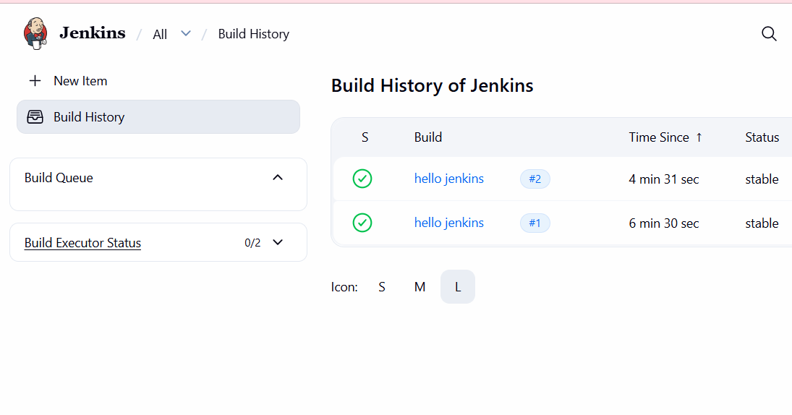
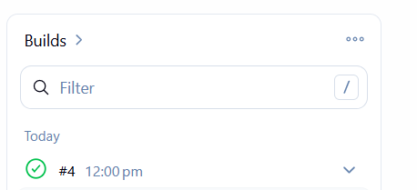
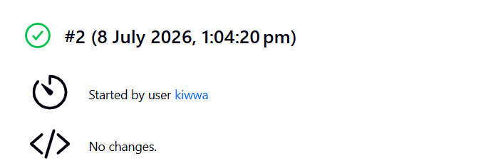
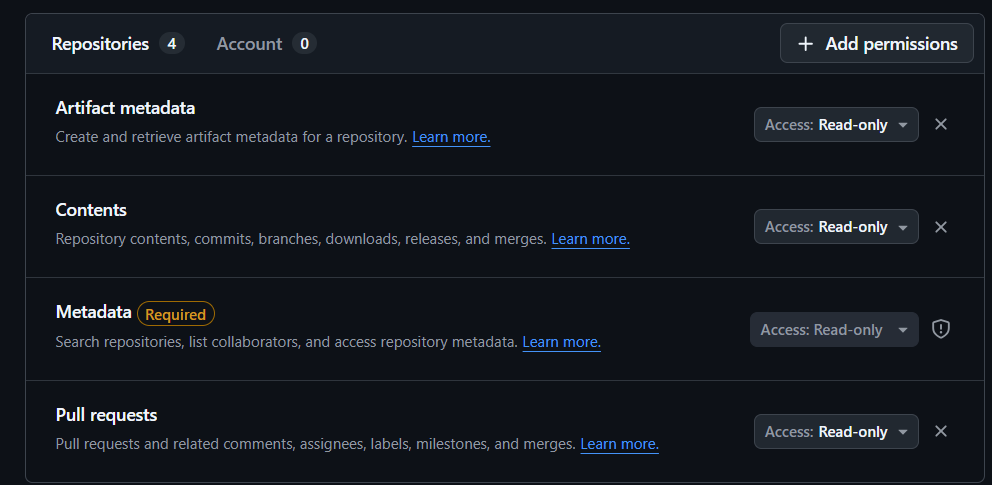
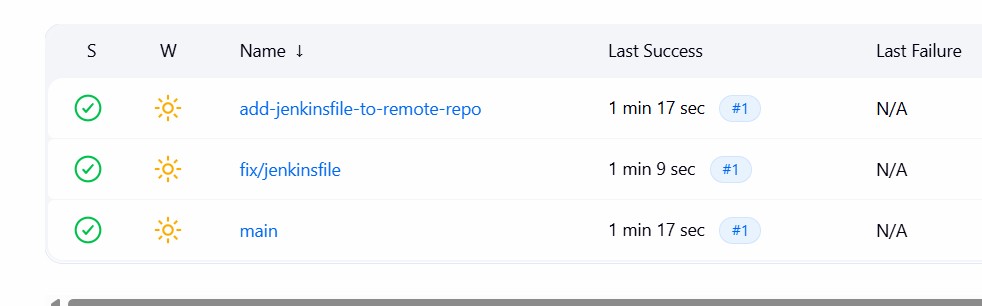
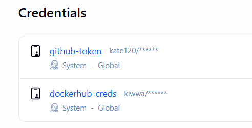
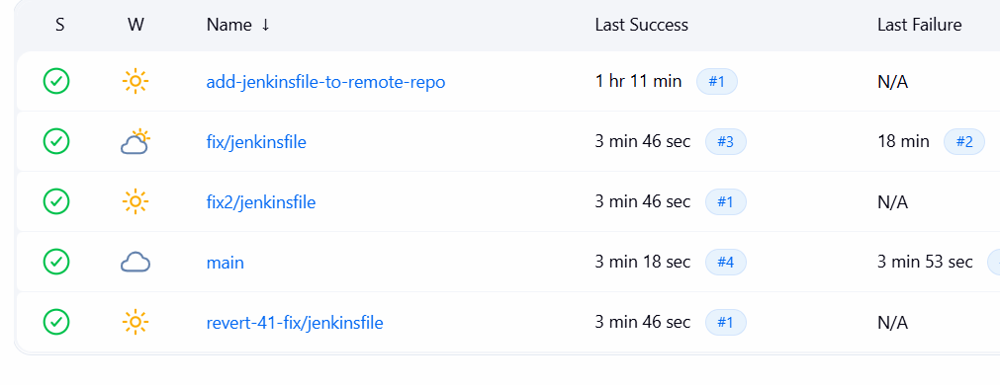

# Модуль 2: Jenkins 101 (CI/CD Локально)
Цель модуля: Развернуть Jenkins локально в Docker и настроить первый Pipeline as Code (Jenkinsfile).
## 1. Задача (Развертывание): Запустить Jenkins (LTS) в Docker.
Задание: docker run -d -p 8080:8080 -p 50000:50000 -v jenkins_home:/var/jenkins_home jenkins/jenkins:lts.
Критерии: UI Jenkins доступен по http://localhost:8080.
```bash
jenkins/jenkins:lts             e82bbdcffb63        810MB          292MB    U  
```
## 2. Задача (Настройка): Пройти "Getting Started". Получить initialAdminPassword (через docker logs ...). Установить плагины (Pipeline, Git).
```bash
# для получения пароля 
docker exec 341a43f4f57e cat /var/jenkins_home/secrets/initialAdminPassword
```
потом через http://localhost:8080 скачать плагины и создать пользователя 

## 3. Задача (Freestyle Job): Создать "Freestyle" (Свободная конфигурация) job.
Задание: Source Code Management -> Git (указать URL). Build Steps -> Execute shell (echo "Hello Jenkins").
Критерии: Нажать "Build Now", сборка (синий шар) успешна.

jenkins - new item - enter an item name - freestyle project - source code management (git) - ввести репозиторий (ветка main) - add build step - execute shell (echo "hello jenkins")


```groovy
// пример пайплана 
pipeline {
    agent any
    
    stages {
        stage('Название') {
            steps {
                sh 'команда'
            }
        }
        // другие стейджи
    }
}
```
## 4. Задача (Теория): "Pipeline as Code".
Контекст: Хранить "рецепт" сборки в коде (в Jenkinsfile), а не в UI Jenkins.
Критерии: Вы понимаете, что UI (Freestyle) — это "старая школа".

    Использованеи Jenkinsfile является практикой IaC, сохраняте декларативный подход, позволяет окатиться к предыдущей версии (git хранит историю).

## 5. Задача (Создание Jenkinsfile): В своем Git-репозитории (e.g., my-app) создать Jenkinsfile (декларативный синтаксис).
pipeline { agent any ... stages { stage('Test') { steps { sh 'pytest' } } } }
```groovy
pipeline {
    agent any

        stages {

            stage('Setup Python') {
                steps {
                    dir('module-08') {
                        sh 'pip install -r requirements.txt'
                    }
                }
            }

            stage('Test') {
                steps {
                    dir('module-08') {
                        sh 'pytest tests/ -v'
                    }
                }
            }


        }
}
```

## 6. Задача (Pipeline Job): В Jenkins создать новый Job типа Pipeline.
Задание: Definition -> Pipeline script from SCM. Указать Git URL и Jenkinsfile.
Критерии: "Build Now" -> Jenkins сам клонирует репо, 
находит Jenkinsfile и запускает pytest.
```groovy
pipeline {
    agent any

    stages {

        stage('Setup Python') {
            steps {
                dir('module-08') {
                    sh '''
                        python3 -m venv venv
                        venv/bin/pip install --no-cache-dir -r requirements.txt
                    '''
                }
            }
        }

        stage('Test') {
            steps {
                dir('module-08') {
                    sh 'venv/bin/pytest tests/ -v'
                }
            }
        }

    }
}
```



## 7. Задача (Docker-in-Docker): Настройка Jenkins для сборки Docker.

Контекст: Jenkins (в Docker) не может "видеть" Docker хоста.
Задание: (Сложно) Перезапустить Jenkins, "пробросив" docker.sock: -v /var/run/docker.sock:/var/run/docker.sock. Установить docker внутри Jenkins-контейнера.
Критерии: В Jenkinsfile шаг sh 'docker ps' успешно выполняется.
```groovy
pipeline {
    agent any
    stages {
    
        stage('Docker') {
            steps {
                sh 'docker ps'
            }
        }
     }
}  
```
```bash
docker run -d -p 8080:8080 -p 50000:50000 -v /var/run/docker.sock:/var/run/docker.sock -v jenkins_home:/var/jenkins_home jenkins/jenkins:lts 
```



## 8. Задача (Сборка Образа): Добавить stage('Build Image') в Jenkinsfile.
steps { sh 'docker build -t my-app-jenkins:${BUILD_NUMBER} .' }
Критерии: Jenkins успешно собирает Dockerfile.
```bash
pipeline {
    agent any

    stages {

        stage('Build Image') {

            steps {
                dir('module-08') {
                    sh "docker build -t my-app-jenkins:${BUILD_NUMBER} ."
                }
            }
        }
    }
}
```
```bash
# заупскаяем контейнер
docker run -d --name jenkins -p 8080:8080 -p 50000:50000 -v jenkins_home:/var/jenkins_home -v /var/run/docker.sock:/var/run/docker.sock -u root jenkins/jenkins:lts
```
```bash
#команды чтобы установить docker внутрь контенера 
apt-get update
apt-get install -y docker.io
docker --version
docker ps
```
```bash
my-app-jenkins:1                1535d225941d        241MB         59.6MB 
```
## 9. Задача (Multibranch Pipeline): Создать Job типа Multibranch Pipeline.
Контекст: Jenkins автоматически сканирует все ветки (branch) и PR в репозитории и запускает Jenkinsfile для каждой.
Критерии: Jenkins находит main и feature/ ветки.

    Сначала я решила локально проверить работу jemkinsfile с локальным репо, я пересоздала контейнер: 
```bash
docker run -d --name jenkins -p 8080:8080 -p 50000:50000 -v jenkins_home:/var/jenkins_home -v /c/Users/katar/Desktop/СТАЖИРОВКА/devops_tr/:/repo -u root -e JAVA_OPTS="-Dhudson.plugins.git.GitSCM.ALLOW_LOCAL_CHECKOUT=true" jenkins/jenkins:lts
```
    JAVA_OPTS="-Dhudson.plugins.git.GitSCM.ALLOW_LOCAL_CHECKOUT=true" разрешает использовать локальный файлы внутри контенера, соответвенно -v /c/Users/katar/Desktop/СТАЖИРОВКА/devops_tr/:/repo этой командой я монтирую раб дир в контейнер.
```groovy
pipeline {
    agent any

    stages {

        stage('Check branch') {
            steps {
                script {
                    def branch = env.BRANCH_NAME
                    echo "this branch is ${branch}"
                }
            }
        }

        stage('chec files') {
            steps {
                echo "files in the branch"
                sh "ls"
            }
        }

        stage('PR') {
            when {
                expression { env.CHANGE_ID != null }  // Только для PR
            }
            steps {
                echo "PR has been checked"
            }
        }

    }


}
```
    Данный пайплан ищет ветки, в которых есть Jenkinsfile (в ранних ветках ранний файл) и выполняет его.

### работа с github репо
```bash
#создать контенер
docker run -d --name jenkins -p 8080:8080 -p 50000:50000 -v jenkins_home:/var/jenkins_home -u root jenkins/jenkins:lts
# скачивает окружение для тестов
apt-get install -y python3 python3-venv python3-pip
```

    На github создать токен и добавить его в Jenkins GitHub → Settings → Developer settings → Personal access tokens → Fine-grained tokens (или Classic, если так привычнее).
    1. Generate new token.
    2. Укажите репозиторий (или "All repositories", если удобнее).
    3. Права (permissions), минимум:
        Contents: Read
        Pull requests: Read
        Metadata: Read (обычно включается автоматически)



    Шаг 2 — добавьте Credentials в Jenkins
    Откройте http://localhost:8080.
    Manage Jenkins → Credentials → System → Global credentials (unrestricted) → Add Credentials.
    Kind: выберите Username with password.
    Username: ваш GitHub-логин (например kate120).
    Password: вставьте сам PAT-токен.
    ID: можно оставить пустым (Jenkins сгенерирует) или задать понятное имя, например github-token.
    Create.
     Ну и просто потом создать и запустить пайплайн.

### Результат: 
```log
Started by user kiwwa
[Thu Jul 09 09:51:45 UTC 2026] Starting branch indexing...
09:51:45 Connecting to https://api.github.com using kate120/******
Examining kate120/inno

  Getting remote pull requests...

  Checking branches...

  Getting remote branches...

    Checking branch main
      ‘Jenkinsfile’ found
    Met criteria
No changes detected: main (still at 0953d8d3b68e4e029a4eeffd38913b9f5ab9b98c)

    Checking branch add-jenkinsfile-to-remote-repo
      ‘Jenkinsfile’ found
    Met criteria
No changes detected: add-jenkinsfile-to-remote-repo (still at 9c222d6425d0cf96ca5e9a4843c9e43eb107da27)

    Checking branch ci/add-github-actions
      ‘Jenkinsfile’ not found
    Does not meet criteria

    Checking branch ci/cd-pipeline-for-module-08
      ‘Jenkinsfile’ not found
    Does not meet criteria

    Checking branch feature/module-01-docker-basics
      ‘Jenkinsfile’ not found
    Does not meet criteria

    Checking branch feature/module-02-dockerfile
      ‘Jenkinsfile’ not found
    Does not meet criteria

    Checking branch feature/module-03-docker-optimization
      ‘Jenkinsfile’ not found
    Does not meet criteria

    Checking branch feature/module-04-docker-networking-volumes
      ‘Jenkinsfile’ not found
    Does not meet criteria

    Checking branch feature/module-05-docker-compose
      ‘Jenkinsfile’ not found
    Does not meet criteria

    Checking branch feature/module-06-docker-compose-servises
      ‘Jenkinsfile’ not found
    Does not meet criteria

    Checking branch feature/module-07-CI-basics
      ‘Jenkinsfile’ not found
    Does not meet criteria

    Checking branch feature/module-08-CI/CD-docker-images
      ‘Jenkinsfile’ not found
    Does not meet criteria

    Checking branch feature/module-09-ansible-basics
      ‘Jenkinsfile’ not found
    Does not meet criteria

    Checking branch feature/module-10-ansible-playbooks
      ‘Jenkinsfile’ not found
    Does not meet criteria

    Checking branch feature/module-11-k8s-minikube-kubelet
      ‘Jenkinsfile’ not found
    Does not meet criteria

    Checking branch feature/module-12-k8s-workloads-deployment-service
      ‘Jenkinsfile’ not found
    Does not meet criteria

    Checking branch feature/module-13-k8s-config-storage
      ‘Jenkinsfile’ not found
    Does not meet criteria

    Checking branch feature/module-14-k8s-networking-helm
      ‘Jenkinsfile’ not found
    Does not meet criteria

    Checking branch feature/module-15-observability-prometeus-grafana
      ‘Jenkinsfile’ not found
    Does not meet criteria

    Checking branch feature/pro-module-01-docker-security-optimization
      ‘Jenkinsfile’ not found
    Does not meet criteria

    Checking branch fix/ci-add-paths-ignore
      ‘Jenkinsfile’ not found
    Does not meet criteria

    Checking branch fix/jenkinsfile
      ‘Jenkinsfile’ found
    Met criteria
No changes detected: fix/jenkinsfile (still at 8242d7856b8a472ad39c281da981fb8a46be5dcc)

    Checking branch revert-34-add-jenkinsfile-to-remote-repo
      ‘Jenkinsfile’ not found
    Does not meet criteria

  23 branches were processed

  Checking pull-requests...

  0 pull requests were processed

Finished examining kate120/inno

[Thu Jul 09 09:51:52 UTC 2026] Finished branch indexing. Indexing took 6.9 sec
Finished: SUCCESS
```
    Для каждой ветки отдельно был запущен Jenkinsfile внутри этой ветки: 
    



## 10. Задача (Credentials): Безопасная публикация.

    На dockerhub был создан новый токен доступа, он был добавлен в jenkins credentials



```groovy
pipeline {
    agent any

    environment {
        IMAGE_NAME = "kiwwa/my-app-jenkins"
        IMAGE_TAG  = "${env.BUILD_NUMBER}"
    }

    stages {

        stage('Check branch') {
            steps {
                script {
                    def branch = env.BRANCH_NAME
                    echo "this branch is ${branch}"
                }
            }
        }

        stage('chec files') {
            steps {
                echo "files in the branch"
                sh "ls"
            }
        }

        stage('Build Image') {
            steps {
                dir('module-08') {
                    sh "docker build -t ${IMAGE_NAME}:${IMAGE_TAG} ."
                }
            }
        }

        stage('Push to Docker Hub') {
            steps {
                withCredentials([usernamePassword(
                    credentialsId: 'dockerhub-creds',
                    usernameVariable: 'DOCKER_USERNAME',
                    passwordVariable: 'DOCKER_PASSWORD'
                )]) {
                    sh '''
                        echo "$DOCKER_PASSWORD" | docker login -u "$DOCKER_USERNAME" --password-stdin
                        docker push ${IMAGE_NAME}:${IMAGE_TAG}
                        docker logout
                    '''
                }
            }
        }

        stage('PR') {
            when {
                expression { env.CHANGE_ID != null }
            }
            steps {
                echo "PR has been checked"
            }
        }

    }
}
```
Задание: Добавить DOCKER_USERNAME / DOCKER_PASSWORD в Jenkins Credentials. В Jenkinsfile использовать withCredentials(...) { sh 'docker login ...' }.
Критерии: Пайплайн пушит образ в Docker Hub, не "светя" пароль в логах.
```bash
Masking supported pattern matches of $DOCKER_PASSWORD
...
+ echo ****
+ docker login -u kiwwa --password-stdin
...
Login Succeeded
```



    Результат: образы опубликованы
