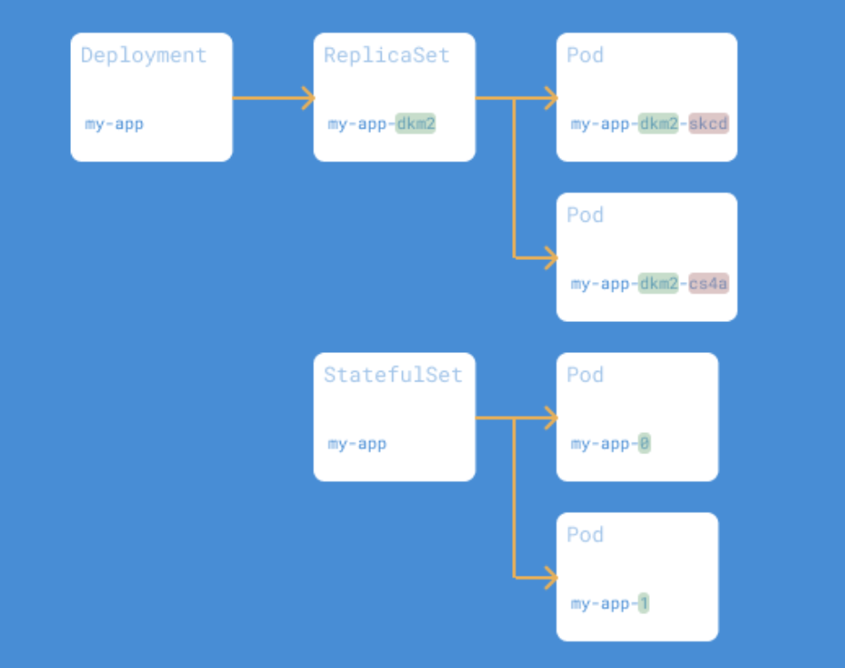
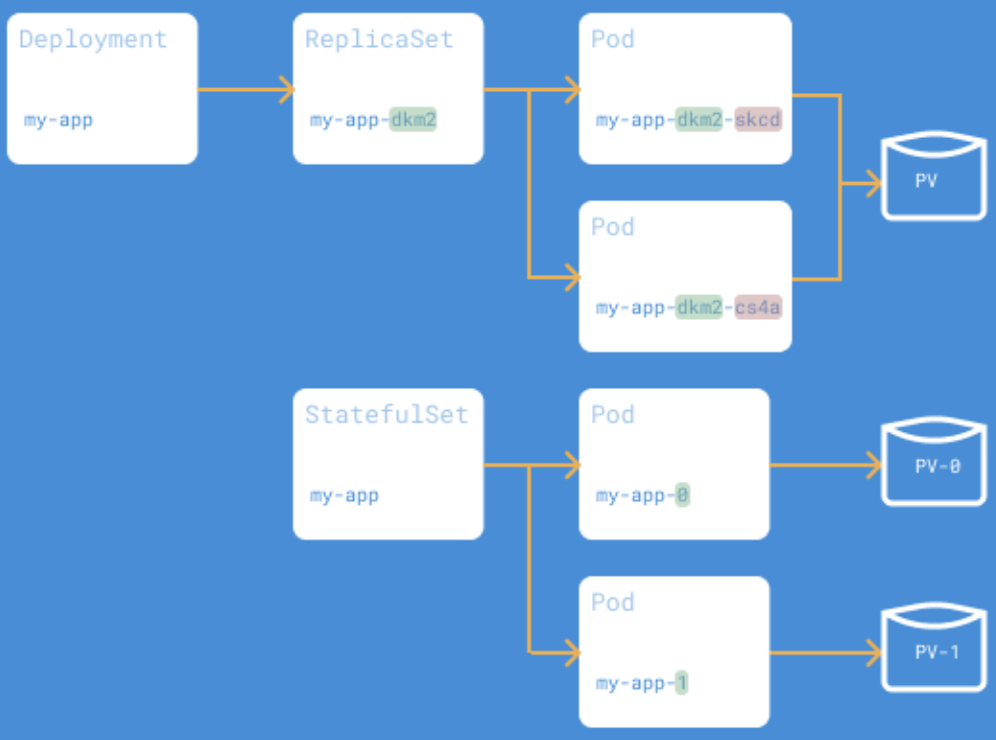

# Модуль 4: K8s 101 (StatefulSet и Хранилища)
Цель модуля: Перейти от Deployment (для stateless) к StatefulSet (для stateful приложений типа БД).
## 1. Задача (Теория): Deployment vs. StatefulSet.
Контекст: Deployment (поды app-1a2b3c, app-4d5e6f). StatefulSet (поды pg-0, pg-1, pg-2).
Задание: Написать эссе, почему БД (Postgres, Kafka) нельзя запускать в Deployment (нужны: стабильные имена, стабильные диски).
Критерии: Эссе написано.

    StatefulSet — это контроллер для управления Подами, которым нужны следующие возможности:
    1. уникальные идентификаторы
    2. стабильные сетевые имена
    3. стабильное постоянное хранилище для каждого Пода
    4. Исходя из названия, можно догадаться, что StatefulSet применяется там, где надо сохранять состояние: 

        Базы данных (MySQL, PostgreSQL, Cassandra) 
        Кэш-системы (Redis, Zookeeper) 
        Брокеры сообщений (RabbitMQ, Apache Kafka)
        Файловые системы и хранилища (Minio, Nexus)



    В Deployment все Поды могут монтировать один и тот же PV (Persistent Volume), если он указан
    В StatefulSet каждый Под монтирует свой собственный PV, что важно для репликации данных в случае stateful-приложений (например, БД)
    StatefulSet назначает Подам постоянные DNS-имена, чтобы каждый Под можно было адресовать по имени.  


## 2. Задача (Теория): StorageClass (SC).
```yml
# 1. Администратор описывает "меню" (StorageClass)
apiVersion: storage.k8s.io/v1
kind: StorageClass
metadata:
  name: fast-ssd                    # Имя класса
provisioner: kubernetes.io/aws-ebs  # Драйвер для AWS
parameters:
  type: gp3                         # Тип диска в AWS
  fsType: ext4                      # Файловая система
reclaimPolicy: Delete               # Удалять диск, когда не нужен
```
```yml
# 2. Разработчик просто использует это "меню"
apiVersion: v1
kind: PersistentVolumeClaim
metadata:
  name: my-app-storage
spec:
  storageClassName: fast-ssd   # Заказываем "быстрый SSD"
  resources:
    requests:
      storage: 5Gi
```
Контекст: "Драйвер" для дисков (e.g., aws-ebs, gcp-pd). В Minikube это standard.
Критерии: kubectl get sc показывает standard (default).

  StorageClass — это "рецепт", описывающий, как и где автоматически создать новый PV, когда придёт PVC, который его запрашивает
  Static provisioning (без StorageClass) — администратор заранее создаёт набор PV вручную, PVC потом "подбирает" подходящий из уже существующих.
  Dynamic provisioning (со StorageClass, современный стандартный подход) — PV создаётся автоматически в момент, когда появляется PVC с указанным storageClassName — ничего не нужно готовить заранее.

## 3. Задача (Теория): PersistentVolume (PV) и PersistentVolumeClaim (PVC).
Контекст: PV — это "кусок" диска. PVC — это "запрос" (e.g., "Хочу 5 ГБ").

  Посредником между подом и pv является pvc, при создании пода к нему прописывается pvc, далее, если поду не хватает памяти, т е дискового пространства, он вызывает PVC, а та уже PV 

## 4. Задача (YAML - StatefulSet): Создать postgres-statefulset.yml.
kind: StatefulSet, serviceName: "postgres-headless"
```yml
apiversion: v1
kind: StatefulSet
metadata: 
  name: postgres-headless
```
## 5. Задача (YAML - Headless Service): Создать postgres-headless-service.yml.
spec: { clusterIP: None } (Нужен для StatefulSet, чтобы у подов были DNS-имена pg-0.postgres-headless, pg-1...).
```yml
apiversion: v1
kind: Service
metadata:
  name: postgres-headless-service
  labels:
    app: postgres
spec:
  clusterIP: None
  selector:
    app: postgres
  ports:
    - port: 5432
      targetPort: 5432
```
## 6. Задача (YAML - volumeClaimTemplates): В спеке StatefulSet описать volumeClaimTemplates.
Контекст: K8s автоматически создаст отдельный PVC для каждой реплики (pg-0 получит data-pg-0, pg-1 получит data-pg-1).
Критерии: volumeClaimTemplates описан.
```yml
apiVersion: apps/v1
kind: StatefulSet
metadata:
  name: postgres-statefulset
  labels:
    app: postgres
spec:
  serviceName: "postgres-headless-service"
  replicas: 3
  selector:
    matchLabels:
      app: postgres
  template:
    metadata:
      labels:
        app: postgres
    spec:
      containers:
        - name: postgres
          image: postgres:15-alpine
          env:
            - name: POSTGRES_PASSWORD
              value: "mysecretpassword"
          ports:
            - containerPort: 5432
          volumeMounts:
            - name: postgres-storage
              mountPath: /var/lib/postgresql/data
  volumeClaimTemplates:
    - metadata:
        name: postgres-storage    
      spec:                    
        accessModes: ["ReadWriteOnce"]
        resources:
          requests:
            storage: 10Gi
```
## 7. Задача (Применение): kubectl apply ...
Критерии: kubectl get statefulset (1 Ready), kubectl get pods ( pg-0 Running), kubectl get pvc (data-pg-0 Bound).
```bash
PS C:\Users\katar\Desktop\СТАЖИРОВКА\devops_tr\pro-module-04> kubectl get statefulset 
NAME                   READY   AGE
postgres-statefulset   3/3     25m
```

  ЗА созданеи PVC отвечает блок volumeClaimTemplates в создании postgres-statefulset.yml
```yml
volumeClaimTemplates:
    - metadata:
        name: postgres-storage
      spec:
        accessModes: ["ReadWriteOnce"]
        resources:
          requests:
            storage: 10Gi
```

## 8. Задача (Масштабирование): kubectl scale statefulset postgres --replicas=3.
Критерии: K8s последовательно (один за другим) запускает pg-1 и pg-2, создавая data-pg-1 и data-pg-2.

  kubectl scale statefulset postgres --replicas=4 с помощью этой комнады можно изменить колл подов

```bash
PS C:\Users\katar\Desktop\СТАЖИРОВКА\devops_tr\pro-module-04> kubectl get pods                                           
NAME                     READY   STATUS    RESTARTS   AGE
postgres-statefulset-0   1/1     Running   0          30m
postgres-statefulset-1   1/1     Running   0          29m
postgres-statefulset-2   1/1     Running   0          29m
postgres-statefulset-3   1/1     Running   0          7s
```
## 9. Задача (Failover): "Убить" Pod: kubectl delete pod pg-1.
Критерии: K8s немедленно перезапускает Pod pg-1. Он автоматически "подхватывает" свой старый диск data-pg-1. Данные не потеряны.

  При удалении пода, в котором ранее я создала таблицу, данные сохранились, т е при новом создании пода они вывелись на экран (при входе в контейнер).

## 10. Задача (Развертывание MySQL и MongoDB через Helm):
Задание: helm install mysql bitnami/mysql и helm install mongo bitnami/mongodb (которые внутри используют StatefulSet).

  winget install Helm.Helm чтобы скачать Helm. 
  helm repo update
  helm uninstall mysql 

```bash
PS C:\Users\katar\Desktop\СТАЖИРОВКА\devops_tr> helm list 
NAME    NAMESPACE       REVISION        UPDATED                                 STATUS          CHART           APP VERSION
mongo   default         1               2026-07-16 16:26:40.269726 +0300 +03    deployed        mongodb-19.1.17 8.3.4      
mysql   default         1               2026-07-16 16:34:09.0714448 +0300 +03   deployed        mysql-14.0.3    9.4.0 
```
```yml
PS C:\Users\katar\Desktop\СТАЖИРОВКА\devops_tr> kubectl get pod                     
NAME                            READY   STATUS    RESTARTS      AGE
mariadb-0                       0/1     Running   1 (25s ago)   2m49s
mongo-mongodb-55867c76f-pgmqj   1/1     Running   0             24m
postgres-statefulset-0          1/1     Running   0             122m
postgres-statefulset-1          1/1     Running   0             158m
postgres-statefulset-2          1/1     Running   0             158m
postgres-statefulset-3          1/1     Running   0             128m
```  

Критерии: В кластере Minikube развернуты 3 разные СУБД (Postgres, MySQL, Mongo).
