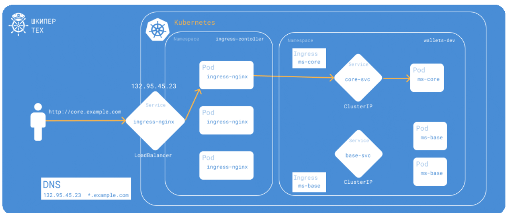
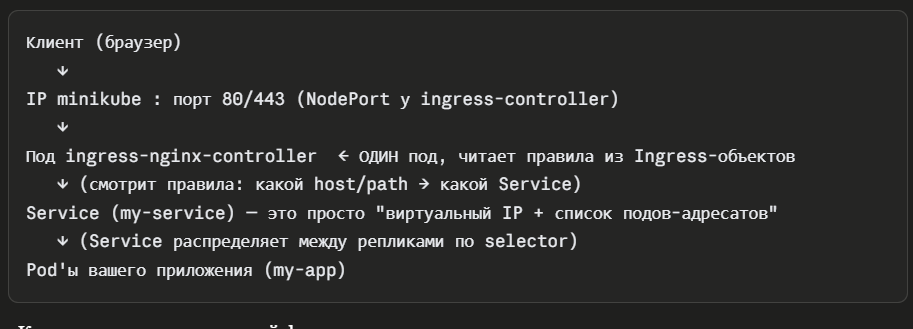
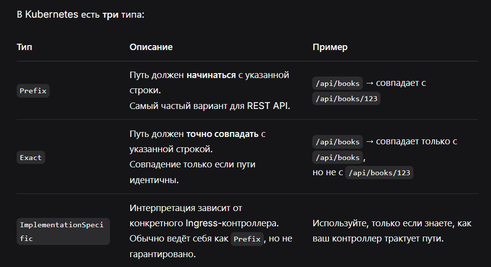

# Модуль 5: K8s Networking (Ingress, NetworkPolicy, CoreDNS)
Цель модуля: Углубиться в сетевое взаимодействие внутри и снаружи K8s.
## 1. Задача (Теория): Типы Service (ClusterIP, NodePort, LoadBalancer).
Критерии: Вы можете объяснить, что ClusterIP (внутренний, по умолчанию), NodePort (для dev), LoadBalancer (для prod в облаке).

    Service — объект K8s, который даёт стабильный, постоянный адрес для доступа к группе подов, даже если сами поды пересоздаются и меняют свои внутренние IP Типы сервисов:
    1. ClusterIP - общение между подами внутри кластера, из вне нету доступа
    2. LoadBalancer — обращение к приложению (к подам) извне кластера через облачный балансировщик нагрузки, который автоматически создаётся провайдером кластера (AWS/GCP/Azure и т.п.) и получает свой собственный внешний IP-адрес
    3. NodePort — обращение к приложению по IP любой ноды кластера + зарезервированному порту (диапазон 30000-32767 по умолчанию). Работает на всех нодах одновременно, даже если под физически запущен только на одной из них.

## 2. Задача (Теория): Ingress vs. Service.
Контекст: Service (L4, TCP). Ingress (L7, HTTP/HTTPS). Ingress — это "умный" роутер (app.com/api -> app-service).

    Лучшей практикой является комбинация ClusterIP + Ingress, на ингрес поступает внешний запрос, он делает запрос к сервису, тот к поде и так в обраном направлении. Ингрес находится в другом NS

 

## 3. Задача (Установка Ingress): minikube addons enable ingress.
Критерии: NGINX Ingress Controller запущен в kube-system.

```bash
minikube addons enable ingress

```
    По сути, minikube поставляется "голым" минимальным кластером Kubernetes — без Ingress-контроллера, без dashboard, без метрик и прочего. Addons — это готовые, преднастроенные пакеты популярных дополнений, которые команда minikube поддерживает "из коробки" для удобства разработки.
```
    1. ingress-nginx-controller-... — это и есть сам работающий Ingress-контроллер. 1/1 Running значит "жив и работает, слушает трафик". Он единственный, кто реально что-то делает постоянно.
    2-3. admission-create и admission-patch — это Job'ы (одноразовые задачи), а не постоянные поды. Они запускаются один раз при установке addon-а и делают вот что:
    admission-create — генерирует TLS-сертификат для admission webhook (специального механизма, который проверяет корректность Ingress-манифестов перед тем, как они попадут в кластер)
    admission-patch — "прошивает" этот сертификат в конфигурацию webhook

``` 



## 4. Задача (YAML - Ingress Path-based): Создать app-ingress.yml.
Задание: Настроить Ingress: path: /api/books -> book-service, path: /api/users -> user-service.



```yml
apiVersion: networking.k8s.io/v1
kind: Ingress
metadata:
  name: simple-ingress
  labels:
    app: simple
spec:
  ingressClassName: nginx
  rules:
    - host: example.com
      http:
        paths:
          - path: /api/books
            pathType: Prefix
            backend:
              service:
                name: book-service
                port:
                  number: 80
          - path: /api/users
            pathType: Prefix
            backend:
              service:
                name: user-service
                port:
                  number: 80
```
Критерии: Ingress работает (тест через curl $(minikube ip)/api/books).
## 5. Задача (YAML - Ingress Host-based): Настроить Ingress (через hosts файл).
Задание: host: books.my-app.local -> book-service, host: users.my-app.local -> user-service.

  В файле по пути C:\Windows\System32\drivers\etc\hosts добавляется 2 записи, где IP ингресса и домены.

Критерии: Маршрутизация по хосту работает.
## 6. Задача (Теория): CNI (Container Network Interface).
Контекст: "Драйвер" сети. Flannel, Calico, WeaveNet.
Критерии: Вы понимаете, что CNI отвечает за реальную сеть "pod-to-pod".
## 7. Задача (Теория): CoreDNS.
Задание: kubectl get pods -n kube-system (найти coredns). kubectl exec -it [pod] ... cat /etc/resolv.conf.
Критерии: Вы понимаете, что K8s Service Discovery (e.g., postgres-db) работает через CoreDNS.
```bash
PS C:\Users\katar\Desktop\СТАЖИРОВКА\devops_tr> kubectl get pods -n kube-system -l k8s-app=kube-dns
NAME                       READY   STATUS    RESTARTS        AGE
coredns-7d764666f9-rqgmr   1/1     Running   2 (2m17s ago)   11d
```
  cat /etc/resolv.conf. через cat не получиться просмотреть содержиоме файла, т к в поде эта утилита не скачана. Можно посмотерть логи: 

```
PS C:\Users\katar\Desktop\СТАЖИРОВКА\devops_tr> kubectl logs -n kube-system coredns-7d764666f9-rqgmr --tail=20          
[INFO] plugin/kubernetes: waiting for Kubernetes API before starting server
[INFO] plugin/kubernetes: waiting for Kubernetes API before starting server
[INFO] plugin/kubernetes: waiting for Kubernetes API before starting server
[INFO] plugin/kubernetes: waiting for Kubernetes API before starting server
[INFO] plugin/kubernetes: waiting for Kubernetes API before starting server
[WARNING] plugin/kubernetes: starting server with unsynced Kubernetes API
.:53
[INFO] plugin/reload: Running configuration SHA512 = e7e8a6c4578bf29b9f453cb54ade3fb14671793481527b7435e35119b25e84eb3a79242b1f470199f8605ace441674db8f1b6715b77448c20dde63e2dc5d2169
CoreDNS-1.13.1
linux/amd64, go1.25.2, 1db4568
[INFO] 127.0.0.1:45797 - 51387 "HINFO IN 6663745846802315385.7015279718314316260. udp 57 false 512" NXDOMAIN qr,rd,ra 57 0.061797769s
[INFO] plugin/ready: Plugins not ready: "kubernetes"
[ERROR] plugin/kubernetes: Failed to watch
[ERROR] plugin/kubernetes: Failed to watch
[ERROR] plugin/kubernetes: Failed to watch
[INFO] plugin/ready: Plugins not ready: "kubernetes"
[INFO] 10.244.0.108:47456 - 2 "PTR IN 10.0.96.10.in-addr.arpa. udp 41 false 512" NOERROR qr,aa,rd 116 0.002344963s
[INFO] 10.244.0.108:38367 - 3 "AAAA IN kubernetes.default.svc.cluster.local. udp 54 false 512" NOERROR qr,aa,rd 147 0.000325372s
[INFO] 10.244.0.108:41133 - 4 "A IN kubernetes.default.svc.cluster.local. udp 54 false 512" NOERROR qr,aa,rd 106 0.000369239s
[INFO] 10.244.0.108:41150 - 5 "PTR IN 1.0.96.10.in-addr.arpa. udp 40 false 512" NOERROR qr,aa,rd 112 0.000195002s
```
## 8. Задача (YAML - NetworkPolicy): Изоляция Pod'ов.
Контекст: По умолчанию все поды видят всех. NetworkPolicy — это "файрвол" K8s (требует CNI типа Calico).
Задание: Создать NetworkPolicy: PodSelector: app=db (для Postgres) -> Ingress: [ { podSelector: app=api } ] (Разрешить Egress: нет).
Критерии: api может достучаться до db, а hacker-pod — не может.
```yml
apiVersion: networking.k8s.io/v1
kind: NetworkPolicy
metadata:
  name: allow-api-to-db
spec:
  podSelector:           # К кому применяется правило
    matchLabels:
      app: db            # Только к подам с меткой app=db (Postgres)
  policyTypes:
  - Ingress              # Правило для входящего трафика
  ingress:               # Разрешаем входящие соединения
  - from:
    - podSelector:       # От кого разрешаем
        matchLabels:
          app: api       # Только от подов с меткой app=api
    ports:               # (опционально) разрешаем порт
    - port: 5432         # Порт Postgres
      protocol: TCP
```
## 9. Задача (TLS-Termination): Настройка HTTPS на Ingress.
Задание: kubectl create secret tls my-tls --cert=... --key=.... В Ingress добавить tls: [ { hosts: [my-app.local], secretName: my-tls } ].
Критерии: https://my-app.local работает (SSL "терминируется" на Ingress).
```bash
kubectl create secret tls my-tls --cert=server.crt --key=server.key
```
## 10. Задача (Cert-Manager): Автоматизация Let's Encrypt.
Задание: helm install cert-manager jetstack/cert-manager. Создать ClusterIssuer (для Let's Encrypt).
Критерии: Ingress (через аннотации) автоматически запрашивает и обновляет SSL-сертификаты.
```bash
helm repo add jetstack https://charts.jetstack.io
```   

  ClusterIssuer — это ресурс, который говорит cert-manager, какой центр сертификации (CA) использовать для выпуска сертификатов.

```yml
apiVersion: cert-manager.io/v1
kind: ClusterIssuer
metadata:
  name: letsencrypt-prod
spec:
  acme:
    # Укажите свой email для уведомлений от Let's Encrypt
    email: your-email@example.com
    server: https://acme-v02.api.letsencrypt.org/directory
    privateKeySecretRef:
      name: letsencrypt-prod-key
    solvers:
    - http01:
        ingress:
          class: nginx # Укажите класс вашего Ingress-контроллера
```
